# Uber Clone - Full Stack Ride-Hailing Application

A full-stack ride-hailing application built with React, Node.js, Express, MongoDB, and Socket.io. This project replicates core Uber functionality including user and captain registration, real-time ride booking, fare calculation, and live location tracking.

## 🚀 Live Demo

**Frontend & Backend:** [https://uber-tnpe.onrender.com](https://uber-tnpe.onrender.com)

## ✨ Features

### For Users
- 🔐 User registration and authentication with JWT
- 📍 Real-time location-based ride booking
- 💰 Automatic fare calculation for different vehicle types (Auto, Car, Moto)
- 🗺️ Interactive map with pickup and destination selection
- 🔍 Address autocomplete and suggestions
- 📱 Real-time ride status updates
- 🔢 OTP-based ride verification
- 📊 User profile management

### For Captains (Drivers)
- 🚗 Captain registration with vehicle details
- 📞 Real-time ride requests
- ✅ Accept/decline ride requests
- 🎯 OTP verification to start rides
- 🏁 Complete rides and update status
- 👤 Captain profile management

### Technical Features
- ⚡ Real-time communication using Socket.io
- 🗺️ Google Maps integration for geocoding and routing
- 🔒 Secure authentication with JWT tokens
- 🗄️ MongoDB for data persistence
- 🌐 RESTful API architecture
- 📱 Responsive design with React

## 🛠️ Tech Stack

### Frontend
- **React** - UI library
- **Vite** - Build tool and development server
- **React Router** - Client-side routing
- **Leaflet** - Open-source interactive maps library
- **React-Leaflet** - React components for Leaflet maps
- **Axios** - HTTP client
- **Socket.io-client** - Real-time communication

### Backend
- **Node.js** - Runtime environment
- **Express.js** - Web framework
- **MongoDB** - Database
- **Mongoose** - MongoDB ODM
- **Socket.io** - WebSocket library
- **JWT** - Authentication
- **bcrypt** - Password hashing
- **Geoapify API** - Geocoding, routing, and address autocomplete

## 📋 Prerequisites

Before running this project, make sure you have:

- Node.js (v20.x or higher)
- MongoDB Atlas account or local MongoDB installation
- Geoapify API key
- npm or yarn package manager

## 🔧 Installation

### 1. Clone the repository

```bash
git clone https://github.com/Himanshu4754/UBER.git
cd UBER
```

### 2. Install dependencies

```bash
# Install root dependencies
npm install

# Install backend dependencies
cd Backend
npm install

# Install frontend dependencies
cd ../frontend
npm install
```

### 3. Environment Variables

Create a `.env` file in the `Backend` directory:

```env
PORT=3000
MONGODB_URI=your_mongodb_connection_string
JWT_SECRET=your_jwt_secret_key
GEOAPIFY_API_KEY=your_geoapify_api_key
```

### 4. Run the application

#### Development Mode

```bash
# Run backend (from Backend directory)
cd Backend
npm run dev

# Run frontend (from frontend directory)
cd frontend
npm run dev
```

#### Production Mode

```bash
# Build frontend
npm run build-frontend

# Start backend server
npm start
```

## 📁 Project Structure

```
UBER/
├── Backend/
│   ├── controllers/      # Route controllers
│   ├── db/              # Database configuration
│   ├── middlewares/     # Authentication & validation
│   ├── models/          # Mongoose models
│   ├── routes/          # API routes
│   ├── services/        # Business logic
│   ├── socket.js        # Socket.io configuration
│   ├── app.js           # Express app setup
│   └── server.js        # Server entry point
├── frontend/
│   ├── src/
│   │   ├── components/  # React components
│   │   ├── context/     # Context API
│   │   ├── pages/       # Page components
│   │   └── App.jsx      # Main App component
│   └── index.html
└── package.json
```

## 🔌 API Endpoints

### User Routes (`/users`)
- `POST /register` - Register a new user
- `POST /login` - User login
- `GET /profile` - Get user profile (Protected)
- `GET /logout` - User logout (Protected)

### Captain Routes (`/captains`)
- `POST /register` - Register a new captain
- `POST /login` - Captain login
- `GET /profile` - Get captain profile (Protected)
- `GET /logout` - Captain logout (Protected)

### Maps Routes (`/maps`)
- `GET /get-coordinates` - Get coordinates for an address
- `GET /get-distance-time` - Calculate distance and time
- `GET /get-suggestions` - Get address suggestions

### Ride Routes (`/rides`)
- `POST /create` - Create a new ride (User)
- `GET /get-fare` - Calculate fare estimate (User)
- `POST /confirm` - Accept a ride (Captain)
- `GET /start-ride` - Start ride with OTP (Captain)
- `POST /end-ride` - Complete ride (Captain)


## 🔐 Authentication

The application uses JWT (JSON Web Tokens) for authentication. Tokens can be sent in:
- Authorization header as Bearer token
- HTTP-only cookies

Protected routes require valid JWT tokens for access.

## 🗺️ Geoapify & Leaflet Integration

This project uses **Geoapify API** for location services and **Leaflet** for map visualization:

### Geoapify Features:
- **Geocoding** - Convert addresses to coordinates
- **Reverse Geocoding** - Convert coordinates to addresses
- **Routing** - Calculate distances and travel time
- **Autocomplete** - Provide address suggestions

### Leaflet Features:
- Interactive, mobile-friendly maps
- Custom markers and popups
- Real-time location tracking
- Route visualization

To get started, sign up for a free Geoapify API key at [https://www.geoapify.com](https://www.geoapify.com).

## 🚀 Deployment

The application is deployed on Render.com:

1. **Backend**: Deployed as a Web Service
2. **Frontend**: Built and served as static files by the backend
3. **Database**: MongoDB Atlas

### Deployment Configuration

**Build Command:**
```bash
npm run install-backend && npm run install-frontend && npm run build-frontend
```

**Start Command:**
```bash
npm start
```

## 🤝 Contributing

Contributions are welcome! Please feel free to submit a Pull Request.

1. Fork the project
2. Create your feature branch (`git checkout -b feature/AmazingFeature`)
3. Commit your changes (`git commit -m 'Add some AmazingFeature'`)
4. Push to the branch (`git push origin feature/AmazingFeature`)
5. Open a Pull Request

## 📝 License

This project is open source and available under the [MIT License](LICENSE).

## 👨‍💻 Author

**Himanshu Sankadiya**
- GitHub: [@Himanshu4754](https://github.com/Himanshu4754)
- LinkedIn: [Himanshu Sankadiya](https://www.linkedin.com/in/himanshu-sankadiya-3b2708289/)
- Email: [himanshusankadiya3@gmail.com](mailto:himanshusankadiya3@gmail.com)

## 🙏 Acknowledgments

- Geoapify API for location services and geocoding
- Leaflet for open-source mapping library
- Socket.io for real-time communication
- MongoDB Atlas for database hosting
- Render.com for deployment

## 📸 Screenshots

### User Flow
<details>
<summary>Click to view screenshots</summary>

#### Landing Page


#### User Login & Signup
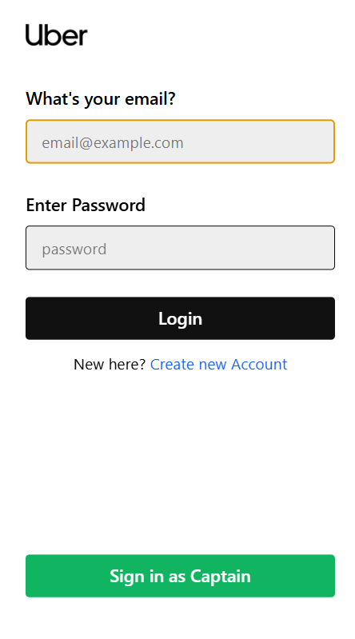
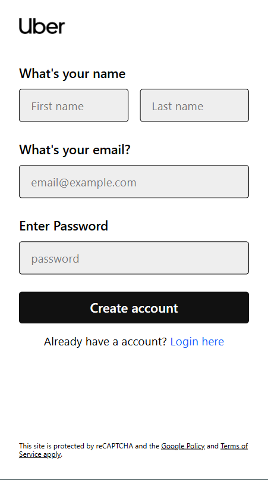

#### Home & Ride Booking
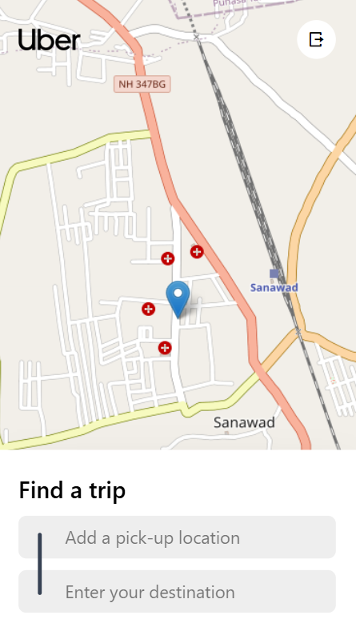
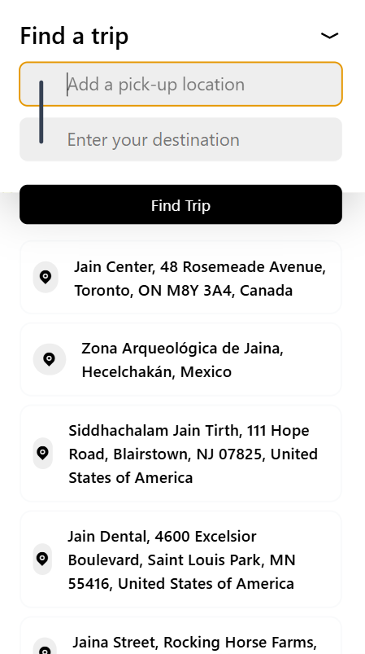
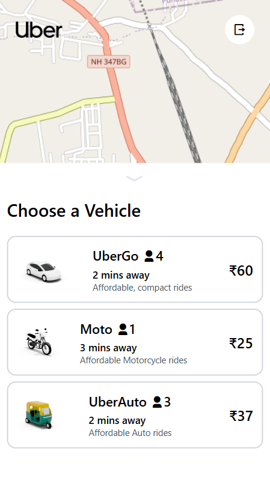
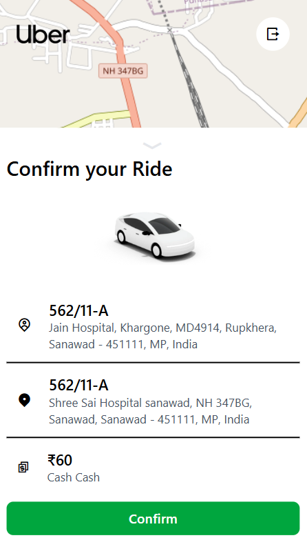

#### Ride Tracking
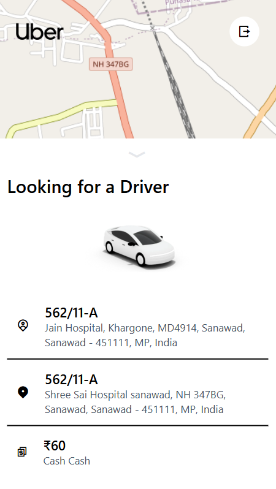
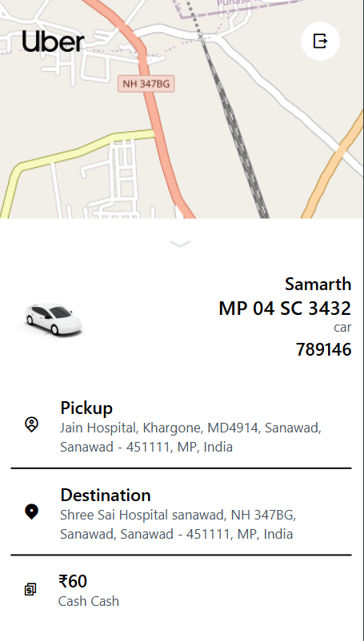
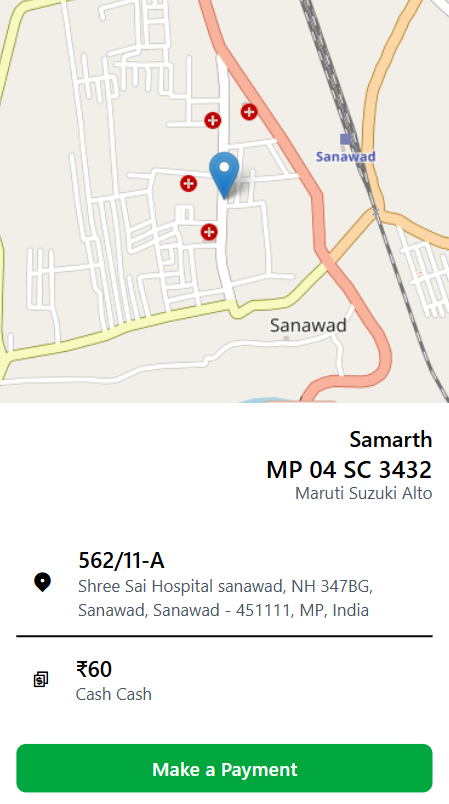

</details>

### Captain Flow
<details>
<summary>Click to view screenshots</summary>

#### Captain Login & Signup
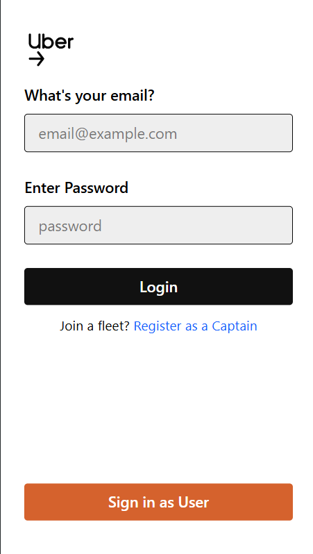
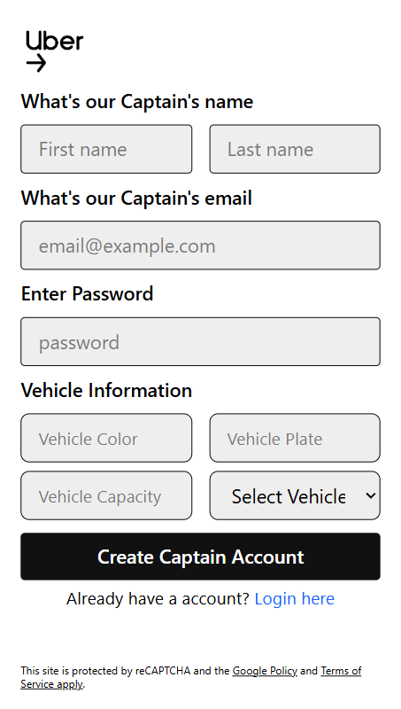

#### Captain Dashboard
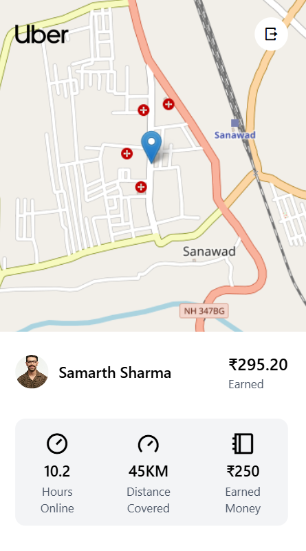
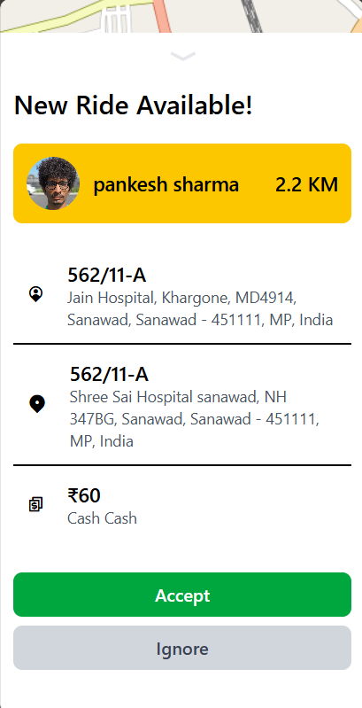
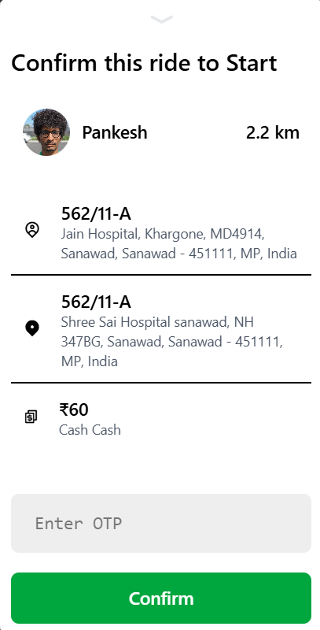
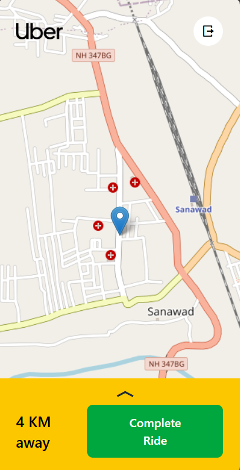
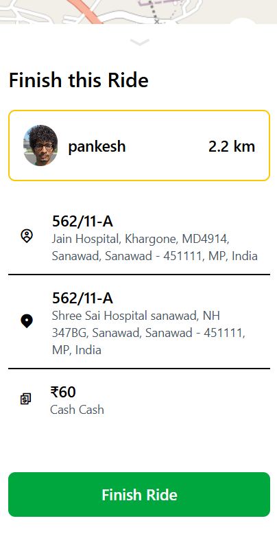

</details>

## 📞 Support

For support, email [himanshusankadiya3@gmail.com](mailto:himanshusankadiya3@gmail.com) or create an issue in the repository.

---

⭐ If you found this project helpful, please give it a star!
